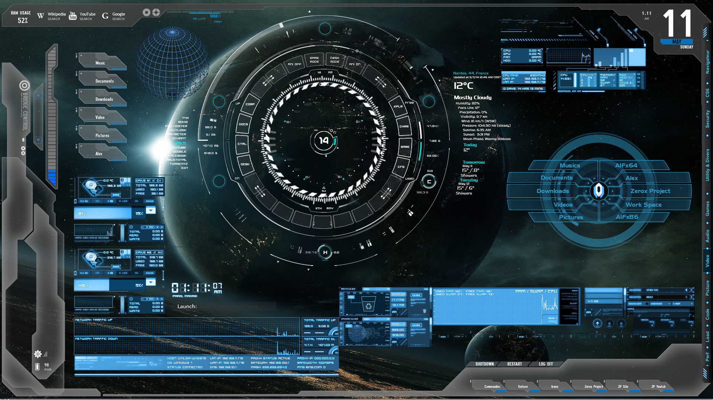

<!---Markdown--->
### Name : Zaman<br/>
<!--You can use double space to create a new line.--> This is Second line using dubble space

---

### Heders Syntax:

# Mahibuzzaman
## Mahibuzzaman
### Mahibuzzaman
#### Mahibuzzaman
##### Mahibuzzaman

---

### ParaGraph
<p> Mahibuzzaman and I am 21 years old I just doing my Engineering <p/>

---

__This is strong/bold text on markdown__

---

<del>This is strikethrough/Delete </del>  
~~This is strike through/Delete~~

---

### Inline Syntax:

`This is inline`  
`<h1>This is Bangladesh<h1/>`  

---

### This is HTML: 

```html
<html>
<head> <head/>

<body>
<body/>

<html/>

```
### This is CSS:
```css

head{
    background-color: green
}
```
### This is Javascript:
```javascript
console.log("hello world")
```

### Ordred List:
---

1. Item1  
2. Item2  
3. Item3  
    a) item 1.1  
    b) item 2.2  
    c) item 3.3  
 4. Item4 


 ### Unordered List:
 ---
 - Item1
 - Item2
 - Item3  
    + item 3.1
    + item 3.2
    + item 3.3
- item4  

### Task List:

- [x] Task1
- [x] Task2
- [x] Task3  
---

### Automatic Link:
https://protoolio.com/lnk/8057693  

### Disbale Link:
`https://protoolio.com/lnk/8057693`  

### Markdown Link syntax:
[websitelink](https://protoolio.com/lnk/8057693)

---
### Image Adding syntax:  
```  
[Forensic](./129-1299685_kali-linux-wallpapers-4k.jpg)
```


---
### Emoji Adding : 😈

---

### Table syntax:
| Name | Email |
| ----- | ------|
| Takeshi | letadif320@dfesc.com |
| Takeshi | letadif320@dfesc.com |
| Takeshi | letadif320@dfesc.com

